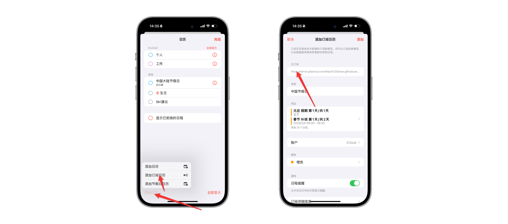

# 中国节假日
支持 Apple日历、Google Calender

## 使用教程

1、拷贝订阅地址

订阅地址（需要科学上网）
```
https://raw.githubusercontent.com/BBC6BAE9/china_holiday/main/china_holiday.ics
```
国内镜像地址

```
https://mirror.ghproxy.com/https://raw.githubusercontent.com/BBC6BAE9/china_holiday/main/china_holiday.ics
```

2、打开“日历”App，添加订阅日历


